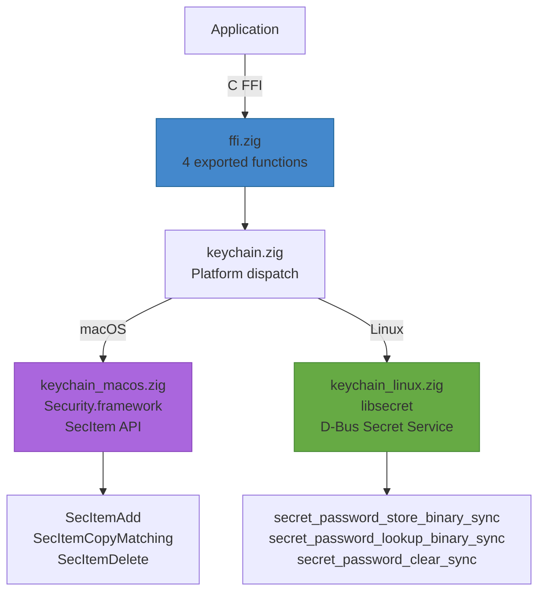

# zig-keychain

Cross-platform keychain/secrets abstraction in Zig with C FFI -- macOS Keychain (SecItem) and Linux Secret Service (libsecret).

**License:** Zlib OR MIT

## Why

Applications need to store credentials, tokens, and other secrets securely. Platform APIs differ significantly: macOS uses Security.framework (SecItemAdd/CopyMatching/Delete), Linux uses the D-Bus Secret Service API via libsecret. This library provides a single C API that works on both platforms.

## Features

- **Store**: Save secrets to the system keychain (upsert semantics -- overwrites existing)
- **Lookup**: Retrieve secrets by service + account name
- **Delete**: Remove secrets by service + account name
- **Search**: Find keychain items matching an account name (declared in header, macOS implemented)
- **C FFI**: 4 exported functions callable from Swift, C, C++, or any language with C interop
- **macOS**: Security.framework (kSecClassGenericPassword)
- **Linux**: libsecret (org.freedesktop.secrets / D-Bus Secret Service)

## Requirements

- Zig 0.15.2+
- macOS 13+ (Security.framework) or Linux (libsecret-1)

## Architecture



## Build

```bash
# Static library (libzig-keychain.a)
zig build -Doptimize=ReleaseFast

# Run unit tests
zig build test
```

With Nix:

```bash
nix develop       # dev shell
nix build         # build library package
```

## Platform Support

| Platform | Backend | Packages | Status |
|----------|---------|----------|--------|
| macOS 13+ (arm64/x86_64) | Security.framework (SecItem) | None | Tested |
| Linux (x86_64/arm64) | libsecret (D-Bus Secret Service) | `libsecret-1-dev` (apt) / `libsecret-devel` (dnf) | Supported |
| Cross-compilation | -- | Frameworks/libs linked at final build | Supported |

## C FFI API Reference

Header: [`include/zig_keychain.h`](include/zig_keychain.h)

### Store

```c
// Store a generic secret in the system keychain/secret store.
// Uses upsert semantics: existing item with same service+account is replaced.
// Returns: 0 on success, -1 on failure
//
// macOS: SecItemDelete + SecItemAdd (kSecClassGenericPassword)
// Linux: secret_password_store_binary_sync
int zig_keychain_store(
    const char *service, size_t service_len,
    const char *account, size_t account_len,
    const uint8_t *data, size_t data_len
);
```

### Lookup

```c
// Look up a generic secret from the system keychain/secret store.
// Returns: bytes written on success, -1 on not found, -2 on error
//
// macOS: SecItemCopyMatching (kSecReturnData)
// Linux: secret_password_lookup_binary_sync
int zig_keychain_lookup(
    const char *service, size_t service_len,
    const char *account, size_t account_len,
    uint8_t *out, size_t out_capacity
);
```

### Delete

```c
// Delete a generic secret from the system keychain/secret store.
// Returns: 0 on success (including not-found), -1 on error
//
// macOS: SecItemDelete
// Linux: secret_password_clear_sync
int zig_keychain_delete(
    const char *service, size_t service_len,
    const char *account, size_t account_len
);
```

### Search

```c
// Search for keychain items matching an account name.
// Writes matching service names as null-separated strings to out.
// Returns: number of matches found, -1 on error
//
// macOS: SecItemCopyMatching (kSecMatchLimitAll, kSecReturnAttributes)
// Linux: secret_service_search_sync
int zig_keychain_search(
    const char *account, size_t account_len,
    char *out, size_t out_capacity
);
```

**Note:** `zig_keychain_search` is declared in the C header but the FFI implementation is pending.

## Zig API Reference

For direct Zig usage (not via C FFI):

| Module | Public API | Description |
|--------|-----------|-------------|
| `keychain.zig` | `store(service, account, data) !void` | Store a secret (platform-dispatched) |
| `keychain.zig` | `lookup(service, account) !Result` | Lookup a secret (returns `.success`, `.not_found`, or `.err`) |
| `keychain.zig` | `delete(service, account) !void` | Delete a secret (platform-dispatched) |
| `keychain.zig` | `Result` (union: success/not_found/err) | Lookup result type |

## Integration

### As a Git Submodule

```bash
git submodule add https://github.com/Jesssullivan/zig-keychain.git vendor/keychain
cd vendor/keychain && zig build -Doptimize=ReleaseFast
```

Link (macOS): `-lzig-keychain -framework Security -framework CoreFoundation`

Link (Linux): `-lzig-keychain -lsecret-1 -lglib-2.0`

Include: `#include "zig_keychain.h"` (path: `vendor/keychain/include/`)

### Swift via Bridging Header

```swift
#include "zig_keychain.h"

// Store
let data: [UInt8] = Array("my-token".utf8)
zig_keychain_store("MyApp", 5, "user@example.com", 16, data, data.count)

// Lookup
var buf = [UInt8](repeating: 0, count: 256)
let len = zig_keychain_lookup("MyApp", 5, "user@example.com", 16, &buf, buf.count)
if len > 0 {
    let token = String(bytes: buf[0..<Int(len)], encoding: .utf8)
}
```

## License

Dual-licensed under [Zlib](https://opensource.org/licenses/Zlib) and [MIT](https://opensource.org/licenses/MIT). Choose whichever you prefer.
