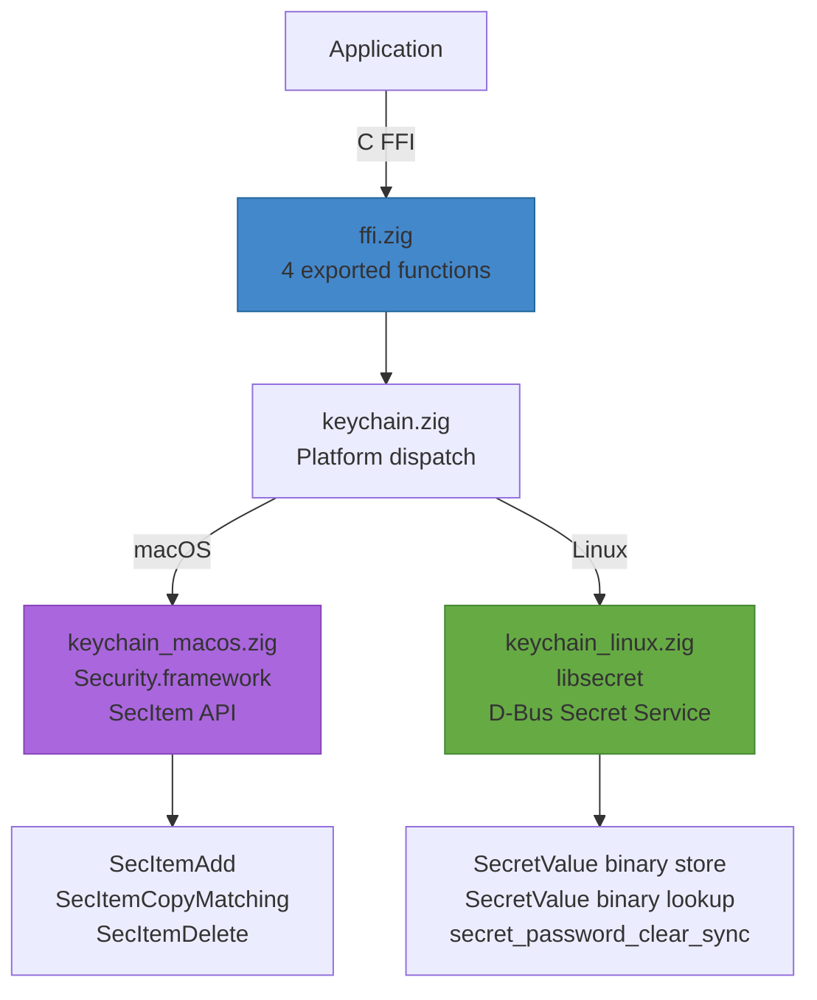

# zig-keychain

Cross-platform keychain/secrets abstraction in Zig with C FFI -- macOS Keychain (SecItem) and Linux Secret Service (libsecret).

**License:** Zlib OR MIT

**Docs:** https://transscendsurvival.org/zig-keychain/

## Why

Applications need to store credentials, tokens, and other secrets securely while keeping the application code portable. Apple apps usually call Keychain Services through Security.framework (`SecItemAdd`, `SecItemCopyMatching`, `SecItemDelete`); Linux desktop apps usually reach the D-Bus Secret Service through libsecret.

zig-keychain provides a small, stable C ABI for generic-password storage: store, lookup, delete, and search by account. It is meant to replace direct platform keychain call sites when porting Apple-oriented application code to Linux or keeping an application's credential boundary independent from a single OS framework.

It is not a replacement for SwiftUI, AppKit, UIKit, Cocoa, iCloud Keychain, Secure Enclave, LocalAuthentication, biometric prompts, keychain access groups, synchronizable items, certificate/key identity APIs, or application UI lifecycle.

## Features

- **Store**: Save secrets to the system keychain (upsert semantics -- overwrites existing)
- **Lookup**: Retrieve secrets by service + account name
- **Delete**: Remove secrets by service + account name
- **Search**: Find keychain items matching an account name
- **C FFI**: 4 exported functions callable from Swift, C, C++, or any language with C interop
- **macOS**: Security.framework (kSecClassGenericPassword)
- **Linux**: libsecret (org.freedesktop.secrets / D-Bus Secret Service)

## Installation

### Zig Package Manager (recommended)

```bash
zig fetch --save git+https://github.com/Jesssullivan/zig-keychain.git
```

Then in your `build.zig`:

```zig
const dep = b.dependency("zig_keychain", .{ .target = target, .optimize = optimize });
exe.root_module.addImport("zig-keychain", dep.module("zig-keychain"));
```

### Git Submodule (C FFI consumers)

```bash
git submodule add https://github.com/Jesssullivan/zig-keychain.git vendor/keychain
cd vendor/keychain && zig build -Doptimize=ReleaseFast
```

Link (macOS): `-lzig-keychain -framework Security -framework CoreFoundation`

Link (Linux): `-lzig-keychain $(pkg-config --libs libsecret-1 glib-2.0)`

Include `#include "zig_keychain.h"`.

## Requirements

- Zig 0.15.2+
- macOS 13+ (Security.framework) or Linux (libsecret-1-dev)

## Architecture



## Build

```bash
# Static library (libzig-keychain.a)
zig build -Doptimize=ReleaseFast

# Run unit tests
zig build test

# Build C example
zig build example
```

With Nix:

```bash
nix develop       # dev shell with Zig 0.15.2
```

## Platform Support

| Platform | Backend | Packages | Status |
|----------|---------|----------|--------|
| macOS 13+ (arm64/x86_64) | Security.framework (SecItem generic passwords) | None | CI build; runtime uses system Keychain |
| Linux (x86_64/arm64) | libsecret (D-Bus Secret Service) | `libsecret-1-dev` (apt) / `libsecret-devel` (dnf) | CI build; runtime needs a Secret Service provider/session |
| Cross-compilation | -- | Frameworks/libs linked by the final application | Build surface supported |

## C FFI API Reference

Header: [`include/zig_keychain.h`](include/zig_keychain.h)

### Store

```c
// Store a generic secret in the system keychain/secret store.
// Uses upsert semantics: existing item with same service+account is replaced.
// Returns: 0 on success, -1 on failure
//
// macOS: SecItemDelete + SecItemAdd (kSecClassGenericPassword)
// Linux: libsecret SecretValue binary store
int zig_keychain_store(
    const char *service, size_t service_len,
    const char *account, size_t account_len,
    const uint8_t *data, size_t data_len
);
```

### Lookup

```c
// Look up a generic secret from the system keychain/secret store.
// Returns: bytes written on success, -1 on not found, -2 on error
//
// macOS: SecItemCopyMatching (kSecReturnData)
// Linux: libsecret SecretValue binary lookup
int zig_keychain_lookup(
    const char *service, size_t service_len,
    const char *account, size_t account_len,
    uint8_t *out, size_t out_capacity
);
```

### Delete

```c
// Delete a generic secret from the system keychain/secret store.
// Returns: 0 on success (including not-found), -1 on error
//
// macOS: SecItemDelete
// Linux: secret_password_clear_sync
int zig_keychain_delete(
    const char *service, size_t service_len,
    const char *account, size_t account_len
);
```

### Search

```c
// Search for keychain items matching an account name.
// Writes matching service names as null-separated strings to out.
// Returns: number of matches found, -1 on error
//
// macOS: SecItemCopyMatching (kSecMatchLimitAll, kSecReturnAttributes)
// Linux: secret_service_search_sync
int zig_keychain_search(
    const char *account, size_t account_len,
    char *out, size_t out_capacity
);
```

## Zig API Reference

For direct Zig usage (not via C FFI):

| Module | Public API | Description |
|--------|-----------|-------------|
| `keychain.zig` | `store(service, account, data) !void` | Store a secret (platform-dispatched) |
| `keychain.zig` | `lookup(service, account, out_buf) !Result` | Lookup a secret into caller-provided memory (returns `.success`, `.not_found`, or `.err`) |
| `keychain.zig` | `delete(service, account) !void` | Delete a secret (platform-dispatched) |
| `keychain.zig` | `search(account, out_buf, out_capacity) !usize` | Search for matching services by account |
| `keychain.zig` | `Result` (union: success/not_found/err) | Lookup result type; success aliases the caller-provided lookup buffer |

## Apple / Swift / Objective-C Interop

zig-keychain replaces only the generic-password keychain call site. The Apple analogs are `SecItemAdd`, `SecItemCopyMatching`, `SecItemDelete`, and attribute queries over `kSecClassGenericPassword`.

Current parity:

- Available: C ABI callable from Swift, Objective-C, C, C++, and other FFI hosts.
- Available: macOS generic-password store, lookup, delete, and account search through Security.framework.
- Available: Linux generic-secret store, lookup, delete, and account search through libsecret.
- Available: binary secret payloads through explicit length parameters.
- Not yet available: SwiftPM/modulemap packaging, ObjC nullability annotations, dedicated Swift wrapper types, ObjC sample app, SecItem/libsecret migration tables, access-control policies, biometric prompts, access groups, synchronizable/iCloud items, certificates, private keys, or Secure Enclave flows.

Good starter contributions should focus on those interop and documentation gaps before expanding the ABI.

## Integration

### As a Git Submodule

```bash
git submodule add https://github.com/Jesssullivan/zig-keychain.git vendor/keychain
cd vendor/keychain && zig build -Doptimize=ReleaseFast
```

Link (macOS): `-lzig-keychain -framework Security -framework CoreFoundation`

Link (Linux): `-lzig-keychain -lsecret-1 -lglib-2.0`

Include: `#include "zig_keychain.h"` (path: `vendor/keychain/include/`)

### Swift via Bridging Header

This repo does not yet ship a SwiftPM package or module map. Today, add `include/zig_keychain.h` to a bridging header and link the static library yourself.

```swift
import Foundation

let data: [UInt8] = Array("my-token".utf8)
let service = "MyApp"
let account = "user@example.com"
var serviceCString = Array(service.utf8CString)
var accountCString = Array(account.utf8CString)

data.withUnsafeBufferPointer { dataBuffer in
    serviceCString.withUnsafeBufferPointer { serviceBuffer in
        accountCString.withUnsafeBufferPointer { accountBuffer in
            _ = zig_keychain_store(
                serviceBuffer.baseAddress,
                service.utf8.count,
                accountBuffer.baseAddress,
                account.utf8.count,
                dataBuffer.baseAddress,
                data.count
            )
        }
    }
}

var buf = [UInt8](repeating: 0, count: 256)
serviceCString.withUnsafeBufferPointer { serviceBuffer in
    accountCString.withUnsafeBufferPointer { accountBuffer in
        buf.withUnsafeMutableBufferPointer { outBuffer in
            let len = zig_keychain_lookup(
                serviceBuffer.baseAddress,
                service.utf8.count,
                accountBuffer.baseAddress,
                account.utf8.count,
                outBuffer.baseAddress,
                outBuffer.count
            )
            if len > 0 {
                let token = String(bytes: buf[0..<Int(len)], encoding: .utf8)
            }
        }
    }
}
```

## Contributing

Start with the [`good first issue`](https://github.com/Jesssullivan/zig-keychain/labels/good%20first%20issue) and [`help wanted`](https://github.com/Jesssullivan/zig-keychain/labels/help%20wanted) queues. The best early contributions are small Swift/ObjC interop examples, documentation truthing, header annotations, and build/package smoke tests.

## License

Dual-licensed under [Zlib](https://opensource.org/licenses/Zlib) and [MIT](https://opensource.org/licenses/MIT). Choose whichever you prefer.
