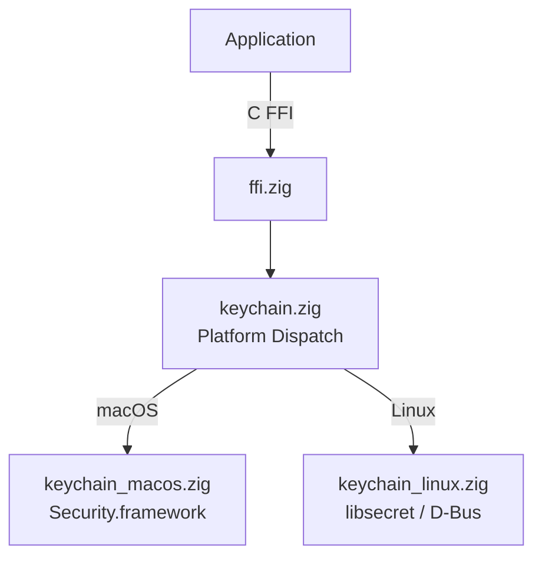

# zig-keychain

Portable system keychain access in Zig -- store, lookup, delete, and search generic secrets using macOS Keychain Services and Linux Secret Service, with a stable C FFI.

**License:** Zlib OR MIT

## Features

- **Store**: Save generic secrets to the system keychain
- **Lookup**: Retrieve secrets by service + account
- **Delete**: Remove secrets from the keychain
- **Search**: Find keychain items matching an account name
- **Platform backends**: macOS (SecItem API), Linux (libsecret/org.freedesktop.secrets)
- **C FFI**: All operations exported for Swift, C, C++ interop
- **Zig package API**: Direct Zig imports use `src/root.zig`; C ABI exports stay in `src/ffi.zig`

## Quick Start

```bash
# Build static library
zig build -Doptimize=ReleaseFast

# Run tests
zig build test

# Build C example
zig build example
```

## Architecture



## Source Tree

```
zig-keychain/
  build.zig              -- Build configuration
  include/
    zig_keychain.h       -- C header (public API)
  src/
    root.zig             -- Zig package API root
    ffi.zig              -- C FFI exports
    keychain.zig         -- Platform dispatch
    keychain_macos.zig   -- macOS Security.framework backend
    keychain_linux.zig   -- Linux libsecret backend
```

## Requirements

- Zig 0.15.2+
- macOS 13+ or Linux with libsecret

## Apple Interop Scope

zig-keychain replaces only the generic-password keychain call site: store, lookup, delete, and search. It does not replace SwiftUI, AppKit, UIKit, Cocoa, iCloud Keychain, Secure Enclave, LocalAuthentication, biometric prompts, access groups, synchronizable items, certificates, private keys, or application UI lifecycle.

See [Apple Interop](guides/apple-interop.md) for Swift/Objective-C status and current parity gaps.
