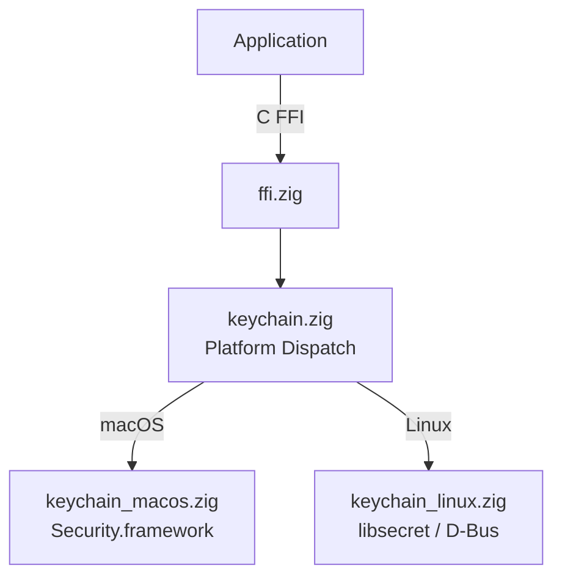

# zig-keychain

Portable system keychain access in Zig -- store, lookup, delete, and search secrets using macOS Keychain (Security.framework) and Linux Secret Service (libsecret/D-Bus).

**License:** Zlib OR MIT

## Features

- **Store**: Save generic secrets to the system keychain
- **Lookup**: Retrieve secrets by service + account
- **Delete**: Remove secrets from the keychain
- **Search**: Find keychain items matching an account prefix
- **Platform backends**: macOS (SecItem API), Linux (libsecret/org.freedesktop.secrets)
- **C FFI**: All operations exported for Swift, C, C++ interop

## Quick Start

```bash
# Build static library
zig build -Doptimize=ReleaseFast

# Run tests
zig build test
```

## Architecture



## Source Tree

```
zig-keychain/
  build.zig              -- Build configuration
  include/
    zig_keychain.h       -- C header (public API)
  src/
    ffi.zig              -- C FFI exports
    keychain.zig         -- Platform dispatch
    keychain_macos.zig   -- macOS Security.framework backend
    keychain_linux.zig   -- Linux libsecret backend
  tests/                 -- Tests
```

## Requirements

- Zig 0.15.2+
- macOS 13+ or Linux with libsecret
